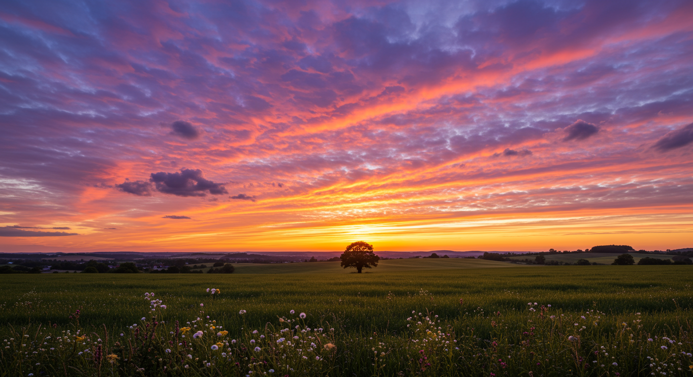
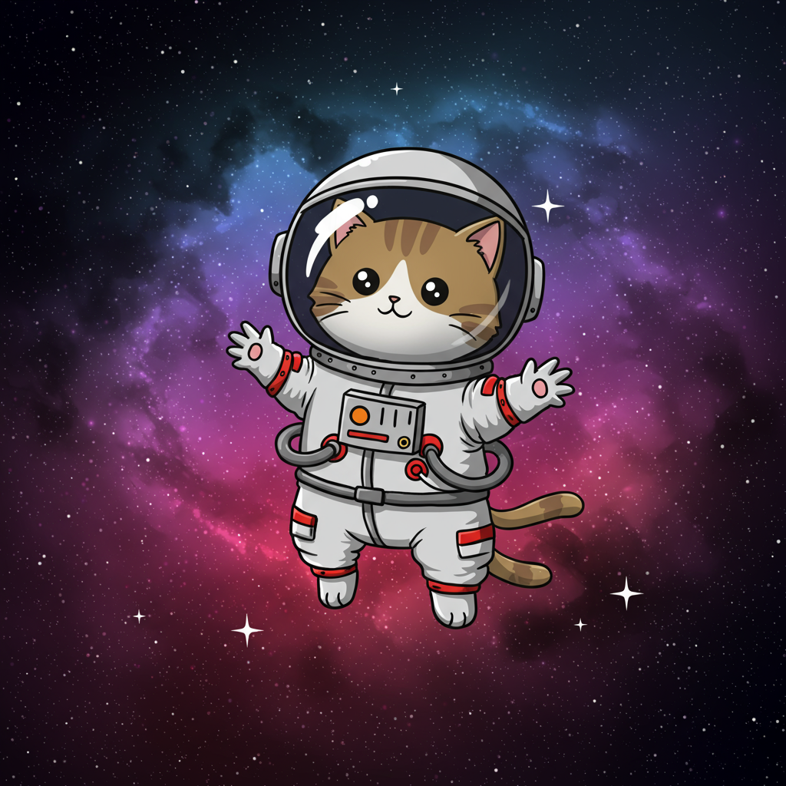
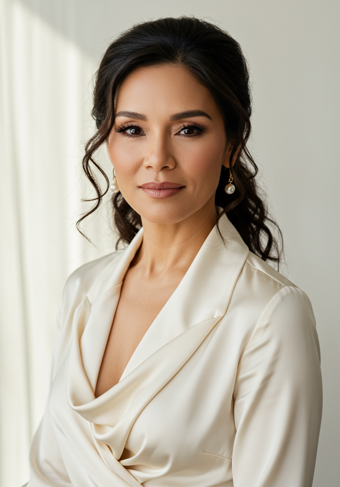
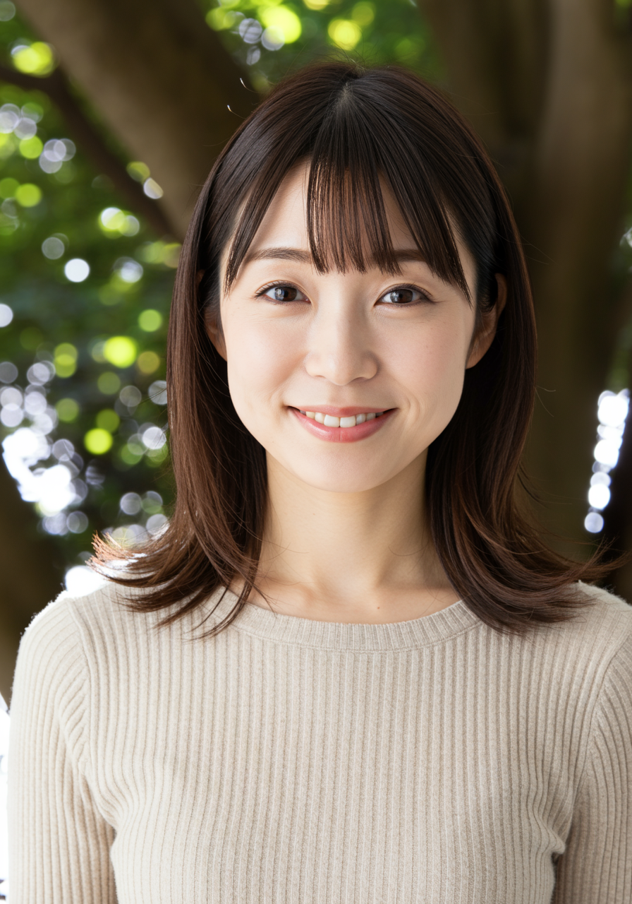

# Vertex AI Imagen MCP Server

[](https://www.npmjs.com/package/@dondonudonjp/vertexai-imagen-mcp-server)
[](https://opensource.org/licenses/MIT)
[](https://www.npmjs.com/package/@dondonudonjp/vertexai-imagen-mcp-server)

**🆕 Latest Update (v0.4.0)**: MCP Resources API対応、file:// URI による効率的な画像配信、ファイル名重複時の自動連番機能

Vertex AI の Imagen API を使用して画像を生成・編集できる MCP（Model Context Protocol）対応サーバーです。Claude Desktop などの MCP クライアントと連携することで、チャット内から自然言語で高度な画像操作が行えます。

---

## 🌟 主な機能

- 🎨 **画像生成**：テキストから高品質な画像を生成
- ✂️ **高度な画像編集**：AIマスク生成、セマンティック編集、背景置換対応
- 🎭 **4つのマスクモード**：手動マスク、背景自動検出、前景自動検出、セマンティック分割
- 🔄 **多様な編集モード**：インペイント除去、インペイント挿入、背景置換
- 📐 **アスペクト比の指定**：1:1, 3:4, 4:3, 9:16, 16:9 に対応
- 🔍 **アップスケーリング**：画像を 2 倍または 4 倍に高品質拡大
- ⚡ **統合処理**：生成と拡大を一括実行
- 🛡️ **安全性フィルター**：安全レベルを柔軟に制御
- 👤 **人物生成制御**：人物の生成有無を細かく設定
- 📁 **画像管理**：生成済み画像の一覧表示・操作
- 🔗 **MCP Resources API**：file:// URI による効率的な画像配信（トークン消費を大幅削減）
- 🔢 **自動ファイル名管理**：重複時の自動連番付加で既存ファイルを保護
- 🔧 **デバッグモード**：ログ出力によるトラブルシュート支援

---

## 📋 前提条件

- **Node.js** v18 以上  
- **MCP 対応クライアント**（例：Claude Desktop、Claude Code）

---

## 🚀 セットアップ手順

### 1. Google Cloud サービスアカウントの作成

#### 手順概要

1. [Google Cloud Console](https://console.cloud.google.com/) へアクセス  
2. プロジェクトを作成または選択  
3. 「APIとサービス」→「ライブラリ」で `Vertex AI API` を有効化  
4. 「IAMと管理」→「サービスアカウント」→「サービスアカウントを作成」  
5. 名前（例：`imagen-mcp-server`）を入力  
6. ロールは「**Vertex AI ユーザー**」を選択し作成  
7. 作成後、「キー」タブから「新しいキーを作成」→「JSON」形式を選びダウンロード

> 🔐 **注意**：ダウンロードしたキーは厳重に保管してください。バージョン管理対象外にすることを推奨します。

---

### 2. プロジェクトのセットアップ

```bash
npm install -g @dondonudonjp/vertexai-imagen-mcp-server

# パッケージがインストールされ、使用準備完了
````

---

### 3. サービスアカウントキーの配置

```bash
# プロジェクト直下に配置する例
cp /path/to/key.json ./google-service-account.json

# config ディレクトリへ配置する例
mkdir -p ~/.config/google-cloud/
cp /path/to/key.json ~/.config/google-cloud/imagen-service-account.json

# アクセス制限（UNIX環境推奨）
chmod 600 ./google-service-account.json
```

---

### 4. インストール方法

#### A. NPM レジストリからインストール（推奨）

```bash
npm install -g @dondonudonjp/vertexai-imagen-mcp-server
vertexai-imagen-mcp-server --version
```

#### B. 開発リンク（npm link）

```bash
npm link
vertexai-imagen-mcp-server --version
```

#### C. Claude Desktop に直接パスを指定

```json
{
  "mcpServers": {
    "google-imagen": {
      "command": "node",
      "args": ["C:\\projects\\vertexai-imagen-mcp-server\\build\\index.js"],
      "env": {
        "GOOGLE_APPLICATION_CREDENTIALS": "C:\\path\\to\\your\\key.json"
      }
    }
  }
}
```

---

## ⚙ Claude Desktop の設定

### 推奨設定（ファイルパスを指定）

```json
{
  "mcpServers": {
    "google-imagen": {
      "command": "vertexai-imagen-mcp-server",
      "env": {
        "GOOGLE_APPLICATION_CREDENTIALS": "/path/to/google-service-account.json"
      }
    }
  }
}
```

> Windows環境ではパス区切りに注意：
> `"C:\\Users\\User\\Documents\\key.json"`

---

### Claude Desktop の再起動

設定ファイルを保存後、Claude Desktop を**完全に再起動**してください（タスクトレイからも終了推奨）。

---
### Claude Code での使用方法

[Claude Code](https://claude.ai/code) でも同様にMCPサーバーとして使用できます。

#### 設定方法

Claude Code の設定ファイルに以下を追加してください：

```json
{
  "mcpServers": {
    "google-imagen": {
      "command": "cmd",
      "args": ["/c", "npx", "-y", "@dondonudonjp/vertexai-imagen-mcp-server"],
      "env": {
        "GOOGLE_APPLICATION_CREDENTIALS": "C:\\path\\to\\your\\google-service-account.json"
      }
    }
  }
}
```

**macOS/Linux の場合:**
```json
{
  "mcpServers": {
    "google-imagen": {
      "command": "npx",
      "args": ["-y", "@dondonudonjp/vertexai-imagen-mcp-server"],
      "env": {
        "GOOGLE_APPLICATION_CREDENTIALS": "/path/to/your/google-service-account.json"
      }
    }
  }
}
```

## 💬 使用方法の例（チャット内での自然言語）

### 画像生成

```
美しい夕日の風景を生成してください
```

### アスペクト比指定

```
16:9 のワイド画面で、山の風景を生成
```

### アップスケーリング

```
"cat.jpg" を4倍に拡大してください
```

### 統合処理（生成 + 拡大）

```
宇宙の画像を縦長で生成し、2倍に拡大して表示してください
```

### 画像編集（NEW！）

#### 背景を自動変更
```
この人物写真の背景を宇宙空間に変えてください
```

#### 不要なオブジェクトを除去
```
この写真から人物を除去してください
```

#### セマンティック編集
```
この画像の人物部分だけを別の服装に変更してください
```
## 🧪 使用例（Claude Code 指示文）※Imagen 3を利用
以下は、Claude Code で VertexAI Imagen MCP サーバーを使用して画像を生成・保存するための自然言語プロンプトの例です。  
保存先は `<<PROJECT_FOLDER>>\docs\images\` を想定しています。


### 🏞️ 例1：美しい夕日の風景

```text
「美しい夕日の風景」をテーマに画像を生成し、横長の 16:9 比率でお願いします。
人物は含めず、安全性フィルターは標準（中リスク以上をブロック）で。
保存ファイル名は sunset_landscape.png としてください。
```


---
### 🐱 例2：宇宙服を着た猫のイラスト

```text
宇宙服を着て星空を漂っている可愛い猫のイラストを生成してください。日本語指定です。
正方形（1:1）の比率で、人物生成は許可せず、安全性フィルターは高リスクのみブロックでお願いします。
保存先ファイルは space_cat.png にしてください。
```

***注意:意図しない画像の生成や、プロンプトの内容によっては安全性フィルターにより画像生成に失敗することがあります。その際は、英語プロンプトでの生成を依頼するか、languageオプションを指定して試してください。***

---
### 🐲 例3：ドラゴンの高解像度画像（生成＋4倍拡大）

```text
ドラゴンのかっこいいイラストを生成し、16:9 の横長比率でお願いします。
人物は含めず、安全性フィルターは標準。
4 倍にアップスケーリング、プロンプトは英語でお願いします。dragon_4x.png に保存してください。
```


---
### 🧒 例4：人物ありのポートレート（成人のみ許可）

```text
人物のポートレート画像を縦長（3:4）で生成してください。
成人の人物生成を許可し、安全性フィルターは高リスクのみブロックでお願いします。プロンプトの言語は日本語です。
保存先は portrait_adult.png にしてください。
```



---

### 🖼️ 例5：背景自動置換（人物写真 → 宇宙背景）

```text
[元画像のファイルパスを記述]
この人物写真の背景を、柔らかな木漏れ日の差す森の風景に変更してください。
自然光が人物を包み込むような、穏やかで温かみのある印象に仕上げてください。
mask_mode は background、edit_mode は bgswap でお願いします。
保存先は forest_background.png にしてください。
```

元画像


生成画像

---

### 🧹 例6：オブジェクト除去（インペイント除去）

```text
この風景写真から不要なオブジェクト（人物や看板など）を自然に除去してください。
前景を自動検出してマスクを作成し、inpaint_removal モードで処理してください。
base_steps は 15 で、保存先は clean_landscape.png にしてください。
```


---

### 👗 例7：セマンティック編集（服装変更）

```text
この人物の服装を変更してください。人物部分のみを対象に、
カジュアルな服装からフォーマルなビジネススーツに変更してください。
mask_mode: semantic、mask_classes: [175, 176]、edit_mode: inpaint_insertion
保存先は formal_outfit.png にしてください。
```


---

### 🏠 例8：手動マスクでの部分編集

```text
この部屋の写真で、窓の外の景色だけを変更したいと思います。
提供されたマスク画像（window_mask.png）を使用して、
窓の外を美しい桜並木の景色に変更してください。
mask_mode: user_provided、mask_image_path: window_mask.png
保存先は sakura_view.png にしてください。
```


---


---

## 🛠 利用可能な MCP ツール

### 1. `generate_image`

テキストから画像を生成します。

* `prompt`（必須）: テキストプロンプト
* `output_path`: 保存ファイル名（省略可）
* `aspect_ratio`: 画像比率（例: 1:1, 16:9）
* `return_base64`: **非推奨** Base64で返却（デフォルト: false）
* `include_thumbnail`: サムネイル生成（128x128、約30-50トークン）。未指定時は環境変数 `VERTEXAI_IMAGEN_THUMBNAIL` の設定に従う
* `safety_level`: 安全性フィルター（BLOCK\_NONE〜BLOCK\_LOW\_AND\_ABOVE）
* `person_generation`: 人物生成ポリシー（DONT\_ALLOW, ALLOW\_ADULT, ALLOW\_ALL）
* `language`: プロンプト処理言語（auto, en, ja, ko など、デフォルト: auto）
* `model`: 使用するImagenモデル（デフォルト: imagen-3.0-generate-002）

---

### 2. `edit_image` - 高度な画像編集

**Imagen 3.0対応**の高度な画像編集機能。AIによる自動マスク生成、セマンティック分割、多様な編集モードに対応します。

#### 基本パラメータ
* `prompt`（必須）: 編集内容の説明
* `reference_image_base64` / `reference_image_path`: 元画像（どちらか必須）
* `output_path`: 保存ファイル名（省略可、デフォルト: `edited_image.png`）
* `return_base64`: **非推奨** Base64で返却（デフォルト: false）
* `include_thumbnail`: サムネイル生成（128x128、約30-50トークン）。未指定時は環境変数 `VERTEXAI_IMAGEN_THUMBNAIL` の設定に従う

#### マスク指定方法（4つの選択肢）

##### 🔹 手動マスク（従来の方法）
```text
mask_mode: "user_provided"
mask_image_base64 / mask_image_path: 白=編集対象、黒=保持領域
```

##### 🔹 背景自動マスク
```text
mask_mode: "background"  # 背景を自動検出してマスク生成
```

##### 🔹 前景自動マスク  
```text
mask_mode: "foreground"  # 前景（主要被写体）を自動検出
```

##### 🔹 セマンティックマスク
```text
mask_mode: "semantic"
mask_classes: [175, 176]  # 人物関連のクラスID（必須）
```

#### 編集モード
* `edit_mode`: 編集タイプ
  - `"inpaint_insertion"`: コンテンツの追加・修正（**デフォルト**）
  - `"inpaint_removal"`: コンテンツの除去
  - `"bgswap"`: 背景置換

#### 高度なパラメータ
* `mask_dilation`: マスク境界の拡張量（0.01-0.1、デフォルト: 0.01）
* `base_steps`: サンプリングステップ数（1-75、除去は12-20、挿入は最大75推奨）
* `guidance_scale`: プロンプトの強さ（0〜30）
* `negative_prompt`: 回避したい要素の指示
* `mask_classes`: セマンティックマスク用クラスID配列
* `model`: 使用する Imagen 編集モデル（デフォルト: `imagen-3.0-capability-001`）

#### 📋 編集パラメータ詳細リファレンス

| パラメータ | 型 | デフォルト | 説明 | 使用例 |
|-----------|---|----------|------|-------|
| `mask_mode` | string | `user_provided` | マスク生成方法 | `"background"`, `"foreground"`, `"semantic"` |
| `edit_mode` | string | `inpaint_insertion` | 編集操作タイプ | `"inpaint_removal"`, `"bgswap"` |
| `mask_classes` | number[] | - | セマンティッククラスID | `[175, 176]` (人物関連) |
| `mask_dilation` | number | `0.01` | マスク境界拡張率 | `0.02` (画像幅の2%) |
| `base_steps` | number | - | サンプリングステップ数 | `15` (除去), `25` (挿入) |
| `guidance_scale` | number | - | プロンプト強度 | `10-20` (標準), `5-9` (弱), `21+` (強) |
| `negative_prompt` | string | - | 回避要素 | `"blurry, low quality, distorted"` |

#### 🎯 推奨設定組み合わせ

| 用途 | mask_mode | edit_mode | base_steps | mask_dilation |
|------|----------|-----------|------------|---------------|
| 背景変更 | `background` | `bgswap` | 20-25 | 0.01-0.02 |
| オブジェクト除去 | `foreground` | `inpaint_removal` | 12-18 | 0.01 |
| 人物服装変更 | `semantic` | `inpaint_insertion` | 25-30 | 0.02 |
| 精密手動編集 | `user_provided` | `inpaint_insertion` | 20-35 | 0.005-0.01 |

---

### 3. `upscale_image`

画像を 2 倍 / 4 倍にアップスケールします。

* `input_path`（必須）: 入力ファイルパス
* `output_path`: 保存ファイル名（省略可）
* `scale_factor`: 倍率（デフォルト: 2）
* `return_base64`: **非推奨** Base64で返却（デフォルト: false）
* `include_thumbnail`: サムネイル生成（128x128、約30-50トークン）。未指定時は環境変数 `VERTEXAI_IMAGEN_THUMBNAIL` の設定に従う

---

### 4. `generate_and_upscale_image`

画像生成とアップスケーリングを一括で行います。
`generate_image` と `upscale_image` の統合処理です。

* `prompt`（必須）: テキストプロンプト
* `output_path`: 保存ファイル名（省略可）
* `aspect_ratio`: 画像比率（例: 1:1, 16:9）
* `scale_factor`: 倍率（デフォルト: 2）
* `return_base64`: **非推奨** Base64で返却（デフォルト: false）
* `include_thumbnail`: サムネイル生成（128x128、約30-50トークン）。未指定時は環境変数 `VERTEXAI_IMAGEN_THUMBNAIL` の設定に従う
* `safety_level`: 安全性フィルター（BLOCK\_NONE〜BLOCK\_LOW\_AND\_ABOVE）
* `person_generation`: 人物生成ポリシー（DONT\_ALLOW, ALLOW\_ADULT, ALLOW\_ALL）
* `language`: プロンプト処理言語（auto, en, ja, ko など、デフォルト: auto）
* `model`: 使用するImagenモデル（デフォルト: imagen-3.0-generate-002）

---

### 5. `list_generated_images`

ディレクトリ内の画像ファイルを一覧表示します。

* `directory`: 検索対象フォルダ（省略時はカレントディレクトリ）

---

### 利用可能なImagenモデル

| モデル名 | 特徴 | 用途 |
|----------|------|------|
| `imagen-3.0-generate-002` | Imagen 3（標準）| バランスの取れた品質と速度（**デフォルト**） |
| `imagen-3.0-fast-generate-001` | Imagen 3 Fast | 高速生成、品質は標準より劣る |
| `imagen-4.0-generate-preview-06-06` | Imagen 4 | より高品質な画像生成 |
| `imagen-4.0-fast-generate-preview-06-06` | Imagen 4 Fast | 高速かつ高品質な画像生成 |
| `imagen-4.0-ultra-generate-preview-06-06` | Imagen 4 Ultra | 最高品質（処理時間が長い） |

**使用例:**
```text
プロンプト: "美しい山の風景"
モデル: imagen-4.0-ultra-generate-preview-06-06
```

---

### 編集・アップスケール用モデル

| モデル名 | 用途 | 新機能対応 |
|----------|------|-----------|
| `imagen-3.0-capability-001` | **Imagen 3 系の編集・マスク・インペイント対応（デフォルト）** | ✅ 自動マスク生成、セマンティック分割、高度編集モード |
| `imagegeneration@006` | Imagen 2.5 系最終プレビュー（互換目的） | ⚠️ 基本編集のみ（新機能は非対応） |
| `imagegeneration@005` | Imagen 2.5 系旧バージョン（互換目的） | ❌ 非推奨 |
| `imagegeneration@002` | Imagen 2 系旧バージョン（互換目的） | ❌ 非推奨 |

### 🏷️ セマンティックマスク対応クラスID（一部抜粋）

画像編集で`mask_mode: "semantic"`を使用する際の代表的なクラスIDです：

| カテゴリ | クラスID | 説明 | 使用例 |
|----------|----------|------|-------|
| **人物** | `[175, 176]` | 人、人物全体 | 服装変更、人物除去 |
| **動物** | `[17, 18, 19, 20]` | 犬、猫、鳥、馬など | ペット関連編集 |
| **乗り物** | `[3, 6, 8]` | 車、バス、トラック | 車両除去・変更 |
| **建物** | `[1, 2]` | 建物、橋 | 建築物編集 |
| **植物** | `[15, 62]` | 木、花 | 植物・自然編集 |

> 💡 **ヒント**: より詳細なクラスID一覧はGoogle Cloud Vision APIのラベル検出ドキュメントを参照してください。

---

### プロンプトの言語について

省略可。テキスト プロンプト言語に対応する言語コード。サポートされる値は次のとおりです。

- auto: 自動検出。Imagen がサポートされている言語を検出すると、プロンプトとオプションの否定的なプロンプトが英語に翻訳されます。検出された言語がサポートされていない場合、Imagen は入力テキストをそのまま使用するため、予期しない出力になる可能性があります。エラーコードは返されません。
- en: 英語
- ja: 日本語
- ko: 韓国語
- zh: 中国語（簡体）
- zh-tw: 中国語（繁体）
- hi: ヒンディー語
- pt: ポルトガル語
- es: スペイン語

---

## 🧪 開発・テスト

```bash
npm run dev         # 開発モード
DEBUG=1 npm run dev # デバッグモード（詳細ログあり）
```

---

## 🐞 トラブルシューティング

| 症状            | 解決策                                           |
| ------------- | --------------------------------------------- |
| サーバーが起動しない    | パスや Node.js バージョン、サービスアカウント権限を確認              |
| 認証エラー         | `GOOGLE_APPLICATION_CREDENTIALS` のパスとロール設定を確認 |
| 画像生成失敗        | プロンプトをより具体的にするか、`safety_level` を緩和            |
| アップスケーリング失敗   | 入力ファイルの存在と画像形式（PNG, JPG など）を確認                |
| base64 表示されない | Claude が対応していない、または画像が大きすぎる可能性あり              |
| **画像編集失敗**       | **以下の画像編集関連トラブルシューティングを参照**                    |

### 🔧 画像編集関連トラブルシューティング

| 症状 | 原因 | 解決策 |
|------|------|-------|
| マスクが期待通りに動作しない | 自動マスク生成の精度問題 | `mask_dilation`を調整（0.01-0.05）、または手動マスクに変更 |
| セマンティックマスクエラー | `mask_classes`未指定 | `mask_classes: [175, 176]`など適切なクラスIDを指定 |
| 編集結果が不自然 | `base_steps`が不適切 | 除去: 12-18、挿入: 20-35、背景置換: 20-25 に調整 |
| 境界がぼやける | マスク境界の問題 | `mask_dilation`を小さく（0.005-0.01）、マスク画像の解像度確認 |
| プロンプトが効かない | `guidance_scale`が低い | `guidance_scale: 15-25`に設定、`negative_prompt`も併用 |
| パラメータ組み合わせエラー | 互換性のない設定 | `mask_mode: "semantic"`には`mask_classes`必須など確認 |
| 処理時間が長い | `base_steps`が高すぎる | 用途に応じて適切な値に調整（上記推奨表を参照） |
| マスク画像が読み込めない | ファイル形式・パスの問題 | PNG形式推奨、パスの確認、ファイルサイズ10MB以下 |

---

## 📖 コマンドラインと環境変数

```bash
vertexai-imagen-mcp-server --help
vertexai-imagen-mcp-server --version
```

| 変数名                              | 必須 | 説明                          |
| -------------------------------- | -- | --------------------------- |
| `GOOGLE_APPLICATION_CREDENTIALS` | ✅  | サービスアカウントJSONの絶対パス          |
| `GOOGLE_SERVICE_ACCOUNT_KEY`     | ✅  | JSON文字列として直接渡す（代替手段）        |
| `GOOGLE_PROJECT_ID`              | ❌  | プロジェクトID（通常は自動取得）           |
| `GOOGLE_REGION`                  | ❌  | 利用リージョン（例: asia-northeast1） |
| `VERTEXAI_IMAGEN_OUTPUT_DIR`     | ❌  | 画像ファイルのデフォルト保存先ディレクトリ（省略時: ~/Downloads/vertexai-imagen-files） |
| `VERTEXAI_IMAGEN_THUMBNAIL`      | ❌  | サムネイル生成の有効化（`true`で有効、省略時: 無効）。約30-50トークン/画像消費 |
| `DEBUG`                          | ❌  | "1" を指定するとデバッグログ有効          |

---

## 📁 ファイル保存パスについて

### デフォルトの保存先

このMCPサーバーは、Claude DesktopなどのMCPクライアントがコンテナ環境で動作することを考慮し、クロスプラットフォーム対応のパス処理を実装しています。

**デフォルト保存先**: `~/Downloads/vertexai-imagen-files/`

- macOS: `/Users/username/Downloads/vertexai-imagen-files/`
- Windows: `C:\Users\username\Downloads\vertexai-imagen-files\`
- Linux: `/home/username/Downloads/vertexai-imagen-files/`

### パス指定の方法

#### 1. 相対パスを指定（推奨）
```text
# デフォルトディレクトリ配下に保存される
output_path: "my_image.png"
→ ~/Downloads/vertexai-imagen-files/my_image.png

# サブディレクトリも自動作成される
output_path: "animals/cat.png"
→ ~/Downloads/vertexai-imagen-files/animals/cat.png
```

#### 2. 絶対パスを指定
```text
# 絶対パスはそのまま使用される
output_path: "/Users/username/Desktop/image.png"
→ /Users/username/Desktop/image.png

# Windowsの場合
output_path: "C:\\Users\\username\\Pictures\\image.png"
→ C:\Users\username\Pictures\image.png
```

#### 3. 環境変数でカスタマイズ
```json
{
  "mcpServers": {
    "google-imagen": {
      "command": "vertexai-imagen-mcp-server",
      "env": {
        "GOOGLE_APPLICATION_CREDENTIALS": "/path/to/key.json",
        "VERTEXAI_IMAGEN_OUTPUT_DIR": "/Users/username/MyImages"
      }
    }
  }
}
```

この設定により、相対パスは `/Users/username/MyImages/` 配下に保存されます。

### 自動機能

✅ **親ディレクトリの自動作成**: 指定されたパスの親ディレクトリが存在しない場合、自動的に作成されます
✅ **パス検証**: API呼び出し前にパスを検証するため、APIクォータの無駄遣いを防止
✅ **ファイル名重複チェック**: 同名ファイルが存在する場合、自動的に連番を付加（例: `image.png` → `image_1.png` → `image_2.png`）
✅ **ユーザーフレンドリーな表示**: 保存先は `~` 表記で表示されます（例: `~/Downloads/vertexai-imagen-files/image.png`）

#### ファイル名重複の自動処理

同じファイル名で複数回画像を生成した場合、既存ファイルを保護するため自動的に連番が付加されます：

```text
# 1回目の生成
output_path: "landscape.png"
→ ~/Downloads/vertexai-imagen-files/landscape.png

# 2回目の生成（同じファイル名）
output_path: "landscape.png"
→ ~/Downloads/vertexai-imagen-files/landscape_1.png

# 3回目の生成
output_path: "landscape.png"
→ ~/Downloads/vertexai-imagen-files/landscape_2.png
```

この機能により、既存の画像ファイルが誤って上書きされるリスクがなくなります。

---

## ⚡ パフォーマンスとベストプラクティス

### 🖼️ 画像返却モードの選択

このMCPサーバーは2つの画像返却モードをサポートしています：

#### 1. ファイル保存モード（推奨）✅

```text
return_base64: false  # デフォルト
```

**メリット:**
- ⚡ **トークン消費が少ない**: MCPプロトコルでの通信量を大幅削減
- 📁 **ファイル管理が容易**: 生成した画像をローカルファイルとして保存
- 💾 **大きな画像も扱える**: サイズ制限を気にせず高解像度画像を生成可能
- 🔄 **再利用が簡単**: 保存されたファイルを他のツールでも使用可能

**推奨される用途:**
- 通常の画像生成
- アップスケーリング（高解像度化）
- 本番環境での使用
- 複数画像の生成

#### 2. Base64返却モード

```text
return_base64: true
```

**デメリット:**
- ⚠️ **トークン消費が大きい**: 1画像あたり約1,500トークン消費（約1,000語相当）
- 📏 **サイズ制限**: MCPプロトコルでは1MB未満推奨
- 🐌 **通信量増加**: Base64エンコードにより元のサイズの約133%に増加
- 💬 **会話履歴の圧迫**: 長時間の会話でコンテキストを消費

**注意事項:**
> このモードを使用すると、生成画像がBase64文字列としてMCPレスポンスに含まれるため、大量のトークンを消費します。
> `annotations.audience: ["user"]` により画像はLLMのコンテキストからは除外されますが、MCPクライアントへの転送時のトークン消費は削減できません。

**限定的な用途:**
- 一時的なプレビュー表示
- テスト・デモンストレーション
- ファイルシステムアクセスが制限される特殊な環境

### 📊 モード比較表

| 項目 | ファイル保存モード | Base64返却モード |
|------|------------------|-----------------|
| トークン消費 | 最小（~100トークン） | 大（~1,500トークン/画像） |
| サイズ制限 | なし | 1MB未満推奨 |
| ファイル管理 | ✅ 簡単 | ❌ 不可 |
| 転送速度 | ⚡ 高速 | 🐌 低速 |
| 推奨度 | ⭐⭐⭐⭐⭐ | ⭐⭐ |

### 💡 推奨事項

**✅ ファイル保存モードを使用する場合（推奨）:**
```text
# 指示例
「美しい夕日の風景を生成して、sunset.pngとして保存してください」
```

**⚠️ Base64モードは避ける:**
```text
# 非推奨の指示例
「return_base64をtrueにして生成してください」
→ トークン消費が大きいため、特別な理由がない限り使用しないでください
```

### 🔍 MCP Resources API（v0.4.0+）

**✅ 実装済み**：このサーバーは MCP Resources API に完全対応しています。

Model Context Protocolの仕様に準拠し、以下の機能を提供：

- **file:// URIによる画像配信**: 生成された画像は自動的に `file://` URI として返却
- **リソース一覧取得**: `resources/list` エンドポイントで全生成画像を列挙
- **オンデマンド取得**: `resources/read` エンドポイントで画像データを必要時のみ取得
- **トークン効率化**: 画像データはURI参照のみで返却されるため、約1,500トークン/画像を削減

#### 利用方法

ファイル保存モード（デフォルト）を使用すると、自動的にResources API経由で画像が提供されます：

```text
# 画像生成後、以下の情報が返却されます:
✅ file:// URI（例: file:///Users/username/Downloads/vertexai-imagen-files/sunset.png）
✅ MCP Resources APIで参照可能
✅ トークン消費を最小化
```

> 📚 参考: [MCP Specification - Resources](https://modelcontextprotocol.io/specification/2025-06-18/server/resources)

#### Base64モードの非推奨化

**⚠️ 重要**: `return_base64=true` オプションは **v1.0.0で削除予定** です。

- 現在は互換性のため維持されていますが、使用は推奨されません
- Resources API を使用したfile:// URI配信が標準となります
- 既存のBase64モード利用者は、ファイル保存モードへの移行を推奨

### 🖼️ サムネイル機能（オプション）

**✨ 新機能**: 画像プレビュー用のサムネイル自動生成に対応しました。

#### 機能概要

ファイル保存モードで画像を生成する際、オプションで小さなサムネイル画像を生成し、即座にプレビュー表示できます。

#### 有効化方法

**方法1: 環境変数で全体的に有効化（推奨）**

```json
{
  "mcpServers": {
    "google-imagen": {
      "command": "vertexai-imagen-mcp-server",
      "env": {
        "GOOGLE_APPLICATION_CREDENTIALS": "/path/to/key.json",
        "VERTEXAI_IMAGEN_THUMBNAIL": "true"
      }
    }
  }
}
```

**方法2: ツール呼び出し時に個別指定**

```text
# サムネイル有効で生成
include_thumbnail: true

# サムネイル無効で生成
include_thumbnail: false

# 未指定の場合は環境変数の設定に従う
```

#### トークン消費

| モード | トークン消費 | プレビュー表示 | 推奨度 |
|--------|-------------|--------------|--------|
| **file:// URI のみ（デフォルト）** | ~100トークン | ❌ なし | ⭐⭐⭐⭐⭐ **推奨** |
| file:// URI + サムネイル | ~130-150トークン | ✅ 即座に表示 | ⭐⭐⭐⭐ |
| Base64フル画像（非推奨） | ~1,500トークン | ✅ フル画像 | ⭐ |

#### サムネイル仕様

- **サイズ**: 最大128×128ピクセル（アスペクト比維持）
- **品質**: JPEG品質60
- **追加トークン消費**: 約30-50トークン/画像
- **処理時間**: 約5-30ms（画像サイズによる）

#### 技術的詳細

- [Sharp](https://sharp.pixelplumbing.com/) ライブラリによる高速・高品質な画像処理
- アスペクト比を維持したリサイズ
- 元画像より大きくしない制御
- サムネイル生成失敗時も本処理は継続（エラー非表示）

#### 使用例

```text
# 環境変数で有効化後
「美しい夕日の風景を生成してください」

→ file:// URI で高解像度画像を提供
→ 同時に128×128のサムネイルも表示（即座にプレビュー可能）
```

#### 注意事項

⚠️ **Claude Desktopのトークン制限**: 1回の会話でメッセージ最大文字数に達する場合があります。その場合は以下のいずれかの対応を推奨：
- サムネイルを無効化（`VERTEXAI_IMAGEN_THUMBNAIL` を設定しない、またはデフォルトのまま）
- 新しいチャットを開始
- file:// URI経由でフル画像にアクセス（MCP Resources API経由）

💡 **推奨**: 通常の使用では**サムネイル無効（デフォルト）**で十分です。file:// URIでフル画像に即座にアクセスできます。

---

## 🔒 セキュリティ上の注意点

* サービスアカウントキーは `.gitignore` に追加し、公開しないでください
* 最小権限の原則に従い、`Vertex AI ユーザー` 権限のみを付与
* 不要なキーは即削除し、必要に応じて定期的にローテーションしてください

---

## 💰 料金について

Vertex AI の Generative AI モデルの一部を利用しており、**従量課金制**です。

- 最新の価格は以下を参照してください：  
  [https://cloud.google.com/vertex-ai/generative-ai/pricing?hl=ja](https://cloud.google.com/vertex-ai/generative-ai/pricing?hl=ja)

- 価格例（2025年7月時点、変更される可能性あり）:
  - Imagen 3（画像生成）: 約 **$0.040 / 画像**
  - アップスケーリング処理も別途課金対象となる場合があります

### 無料枠について

- **Google Cloud 無料トライアル**：新規アカウントに $300 クレジット（90日間）付与
- Vertex AI 自体には常設の無料枠はありません

> ⚠️ 実際の料金やリージョンごとの価格変動、課金単位などは必ず公式サイトでご確認ください。


## 🤝 コントリビューション歓迎

1. リポジトリをフォーク
2. ブランチを作成（例: `feature/add-func`）
3. 変更をコミット・プッシュ
4. プルリクエストを送信

---

## 📄 ライセンス

MIT License（詳細は `LICENSE` ファイルを参照）

---

## 🙏 謝辞

* [Model Context Protocol](https://modelcontextprotocol.io/)
* [Google Cloud Vertex AI Imagen](https://cloud.google.com/vertex-ai/generative-ai/docs/image/overview)


