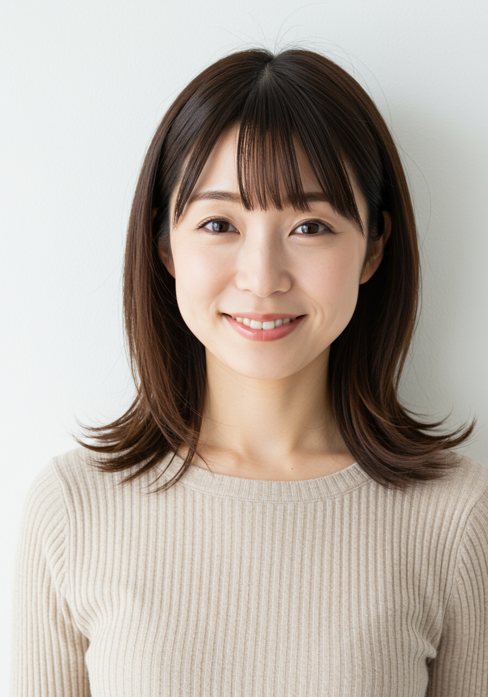
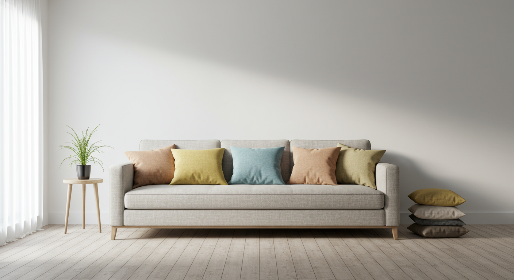

# Vertex AI Imagen MCP Server

[](https://www.npmjs.com/package/@dondonudonjp/vertexai-imagen-mcp-server)
[](https://opensource.org/licenses/MIT)
[](https://www.npmjs.com/package/@dondonudonjp/vertexai-imagen-mcp-server)

**🆕 Latest Update (v0.4.0)**: MCP Resources API対応、file:// URI による効率的な画像配信、ファイル名重複時の自動連番機能

Vertex AI の Imagen API を使用して画像を生成・編集できる MCP（Model Context Protocol）対応サーバーです。Claude Desktop などの MCP クライアントと連携することで、チャット内から自然言語で高度な画像操作が行えます。

---

## 🌟 主な機能

- 🎨 **画像生成**：テキストから高品質な画像を生成
- ✨ **画像カスタマイズ（NEW!）**：参照画像を使った高度な画像生成（構造制御、被写体一貫性、スタイル転送）
- ✂️ **高度な画像編集**：AIマスク生成、セマンティック編集、背景置換対応
- 🎭 **マスクなし編集**：プロンプトのみで簡単に画像編集
- 🎯 **5つのマスクモード**：マスクフリー、手動マスク、背景自動検出、前景自動検出、セマンティック分割
- 🔄 **多様な編集モード**：インペイント除去、インペイント挿入、背景置換、アウトペインティング
- 📐 **アスペクト比の指定**：1:1, 3:4, 4:3, 9:16, 16:9 に対応
- 🔍 **アップスケーリング**：画像を 2 倍または 4 倍に高品質拡大
- ⚡ **統合処理**：生成と拡大を一括実行
- 🛡️ **安全性フィルター**：安全レベルを柔軟に制御
- 👤 **人物生成制御**：人物の生成有無を細かく設定
- 📁 **画像管理**：生成済み画像の一覧表示・操作
- 🏷️ **セマンティッククラスID検索**：画像編集用の194種類のオブジェクトクラスをカテゴリ別・キーワードで検索
- 🔗 **MCP Resources API**：file:// URI による効率的な画像配信（トークン消費を大幅削減）
- 🔢 **自動ファイル名管理**：重複時の自動連番付加で既存ファイルを保護
- 🔧 **デバッグモード**：ログ出力によるトラブルシュート支援

---

## 📋 前提条件

- **Node.js** v18 以上  
- **MCP 対応クライアント**（例：Claude Desktop、Claude Code）

---

## 🚀 セットアップ手順

### 1. Google Cloud サービスアカウントの作成

#### 手順概要

1. [Google Cloud Console](https://console.cloud.google.com/) へアクセス  
2. プロジェクトを作成または選択  
3. 「APIとサービス」→「ライブラリ」で `Vertex AI API` を有効化  
4. 「IAMと管理」→「サービスアカウント」→「サービスアカウントを作成」  
5. 名前（例：`imagen-mcp-server`）を入力  
6. ロールは「**Vertex AI ユーザー**」を選択し作成  
7. 作成後、「キー」タブから「新しいキーを作成」→「JSON」形式を選びダウンロード

> 🔐 **注意**：ダウンロードしたキーは厳重に保管してください。バージョン管理対象外にすることを推奨します。

---

### 2. プロジェクトのセットアップ

```bash
npm install -g @dondonudonjp/vertexai-imagen-mcp-server

# パッケージがインストールされ、使用準備完了
````

---

### 3. サービスアカウントキーの配置

```bash
# プロジェクト直下に配置する例
cp /path/to/key.json ./google-service-account.json

# config ディレクトリへ配置する例
mkdir -p ~/.config/google-cloud/
cp /path/to/key.json ~/.config/google-cloud/imagen-service-account.json

# アクセス制限（UNIX環境推奨）
chmod 600 ./google-service-account.json
```

---

### 4. インストール方法

#### A. NPM レジストリからインストール（推奨）

```bash
npm install -g @dondonudonjp/vertexai-imagen-mcp-server
vertexai-imagen-mcp-server --version
```

#### B. 開発リンク（npm link）

```bash
npm link
vertexai-imagen-mcp-server --version
```

#### C. Claude Desktop に直接パスを指定

```json
{
  "mcpServers": {
    "google-imagen": {
      "command": "node",
      "args": ["C:\\projects\\vertexai-imagen-mcp-server\\build\\index.js"],
      "env": {
        "GOOGLE_APPLICATION_CREDENTIALS": "C:\\path\\to\\your\\key.json"
      }
    }
  }
}
```

---

## ⚙ Claude Desktop の設定

### 推奨設定（ファイルパスを指定）

```json
{
  "mcpServers": {
    "google-imagen": {
      "command": "vertexai-imagen-mcp-server",
      "env": {
        "GOOGLE_APPLICATION_CREDENTIALS": "/path/to/google-service-account.json"
      }
    }
  }
}
```

> Windows環境ではパス区切りに注意：
> `"C:\\Users\\User\\Documents\\key.json"`

---

### Claude Desktop の再起動

設定ファイルを保存後、Claude Desktop を**完全に再起動**してください（タスクトレイからも終了推奨）。

---
### Claude Code での使用方法

[Claude Code](https://claude.ai/code) でも同様にMCPサーバーとして使用できます。

#### 設定方法

Claude Code の設定ファイルに以下を追加してください：

```json
{
  "mcpServers": {
    "google-imagen": {
      "command": "cmd",
      "args": ["/c", "npx", "-y", "@dondonudonjp/vertexai-imagen-mcp-server"],
      "env": {
        "GOOGLE_APPLICATION_CREDENTIALS": "C:\\path\\to\\your\\google-service-account.json"
      }
    }
  }
}
```

**macOS/Linux の場合:**
```json
{
  "mcpServers": {
    "google-imagen": {
      "command": "npx",
      "args": ["-y", "@dondonudonjp/vertexai-imagen-mcp-server"],
      "env": {
        "GOOGLE_APPLICATION_CREDENTIALS": "/path/to/your/google-service-account.json"
      }
    }
  }
}
```

## 🧪 使用例（Claude 指示文）
自然言語で指示するだけで画像生成・編集・管理を行えます。
画像は自動的に `~/Downloads/vertexai-imagen-files/` に保存されます。

### 🟦 Ⅰ. 基本生成（Generate）
#### 例1：シンプル生成
```text
「美しい夕日の風景」をテーマに画像を生成し、横長の 16:9 比率でお願いします。
人物は含めず、安全性フィルターは標準（中リスク以上をブロック）で。
保存ファイル名は sunset_landscape.png としてください。
```
#### 📸 出力例

---

#### 例2：人物ポートレート（成人許可）

```text
人物のポートレートを縦長（3:4）で生成してください。
成人のみ許可し、安全性フィルターは高リスクのみブロック。
保存先は portrait_adult.png にしてください。
```

#### 📸 出力例


---
#### 例3：英語プロンプト比較

```text
language: "en"
Prompt: "A tranquil forest with sunbeams filtering through the trees"
保存先は forest_en.png にしてください。
```

#### 📸 出力例


---

### 🟦 Ⅱ. 画像編集（Edit）

#### 例4：背景変更（人物→森）

```text
[reference_image_path を指定]
この人物の背景を森に置き換えてください。
mask_mode: background
edit_mode: bgswap
保存先は forest_background.png にしてください。
```

#### 📸 入力画像



#### 📸 出力例


---
#### 例5：オブジェクト除去

```text
[reference_image_path を指定]
リビングの写真からソファ上のクッションを除去してください。
mask_mode: foreground
edit_mode: inpaint_removal
保存先は clean_sofa.png にしてください。
```
#### 📸 入力画像


#### 📸 出力例


(￣□￣;)!!
---

#### 例6：服装変更（セマンティック編集）

```text
[reference_image_path を指定]
この女性の服装だけをフォーマルなビジネススーツに変更してください。顔、髪型、表情、ポーズ、背景はそのまま維持してください。紺色または黒のジャケットとパンツのスーツで、インナーは白いブラウス。プロフェッショナルで洗練された印象。
保存先は formal_outfit.pngにしてください。
mask_mode: "semantic"
mask_classes: [125] (人物)
edit_mode: "inpaint_insertion"
mask_dilation: 0.05
```
#### 📸 入力画像


#### 📸 出力例


(￣□￣;)!!
---

#### 例7：マスクなし編集（Mask-Free）

```text
[reference_image_path を指定]
この猫の写真を同じ構図で犬に変えてください。
mask_mode は指定しません。
保存先は dog_transformed.png にしてください。
```
#### 📸 入力画像


#### 📸 出力例


(￣▽￣;)
---


### 🟦 Ⅲ. カスタマイズ生成（Customize）

#### 例8：構図制御（Control）

```text
[reference_image_path を指定]
pose.jpg のポーズを参照し、同じ構図で人物を生成してください。
control_image_path: "pose.png"
control_type: "face_mesh"
保存先は pose_match.png にしてください。
```

---


---
### 🐱 例2：宇宙服を着た猫のイラスト

```text
宇宙服を着て星空を漂っている可愛い猫のイラストを生成してください。日本語指定です。
正方形（1:1）の比率で、人物生成は許可せず、安全性フィルターは高リスクのみブロックでお願いします。
保存先ファイルは space_cat.png にしてください。
```

***注意:意図しない画像の生成や、プロンプトの内容によっては安全性フィルターにより画像生成に失敗することがあります。その際は、英語プロンプトでの生成を依頼するか、languageオプションを指定して試してください。***

---
### 🐲 例3：ドラゴンの高解像度画像（生成＋4倍拡大）

```text
ドラゴンのかっこいいイラストを生成し、16:9 の横長比率でお願いします。
人物は含めず、安全性フィルターは標準。
4 倍にアップスケーリング、プロンプトは英語でお願いします。dragon_4x.png に保存してください。
```


---
### 🧒 例4：人物ありのポートレート（成人のみ許可）

```text
人物のポートレート画像を縦長（3:4）で生成してください。
成人の人物生成を許可し、安全性フィルターは高リスクのみブロックでお願いします。プロンプトの言語は日本語です。
保存先は portrait_adult.png にしてください。
```


---

### 🖼️ 例5：背景自動置換（人物写真 → 森背景）

```text
[元画像のファイルパスを記述]
この人物写真の背景を、柔らかな木漏れ日の差す森の風景に変更してください。
自然光が人物を包み込むような、穏やかで温かみのある印象に仕上げてください。
mask_mode は background、edit_mode は bgswap でお願いします。
保存先は forest_background.png にしてください。
```

元画像


生成画像

---

### 🧹 例6：オブジェクト除去（インペイント除去）

```text
[元画像のファイルパスを記述]
このリビングの写真で、ソファの上に置かれたクッションを自然に除去してください。
ソファ本体や背景の家具は残します。
mask_mode は foreground、edit_mode は inpaint_removal に設定。
base_steps は 16、guidance_scale は 10 にしてください。
保存先は clean_sofa.png にしてください。
```


元画像


生成画像

---

### 👗 例7：セマンティック編集（服装変更）

```text
この人物の服装を変更してください。人物部分のみを対象に、
カジュアルな服装からフォーマルなビジネススーツに変更してください。
mask_mode: semantic、mask_classes: [125]、edit_mode: inpaint_insertion
保存先は formal_outfit.png にしてください。
```


---

### 🏠 例8：手動マスクでの部分編集

```text
この部屋の写真で、窓の外の景色だけを変更したいと思います。
提供されたマスク画像（window_mask.png）を使用して、
窓の外を美しい桜並木の景色に変更してください。
mask_mode: user_provided、mask_image_path: window_mask.png
保存先は sakura_view.png にしてください。
```


---

### ✨ 例9：マスクなし編集（Mask-Free）⭐ **NEW!**

```text
[元画像のファイルパスを記述]
この猫の写真を、同じ構図で犬の写真に変更してください。
背景はそのままで、猫を犬に置き換えるイメージです。
保存先は dog_transformed.png にしてください。
```

**特徴:**
- `mask_mode`を指定せず、プロンプトのみで編集
- AIが自動的に猫の部分を認識して犬に変換
- 最もシンプルで柔軟な編集方法

---


---

## 🛠 利用可能な MCP ツール

### 1. `generate_image`

テキストから画像を生成します。

* `prompt`（必須）: テキストプロンプト
* `output_path`: 保存ファイル名（省略可）
* `aspect_ratio`: 画像比率（例: 1:1, 16:9）
* `return_base64`: **非推奨** Base64で返却（デフォルト: false）
* `include_thumbnail`: サムネイル生成（128x128、約30-50トークン）。未指定時は環境変数 `VERTEXAI_IMAGEN_THUMBNAIL` の設定に従う
* `safety_level`: 安全性フィルター（BLOCK\_NONE〜BLOCK\_LOW\_AND\_ABOVE）
* `person_generation`: 人物生成ポリシー（DONT\_ALLOW, ALLOW\_ADULT, ALLOW\_ALL）
* `language`: プロンプト処理言語（auto, en, ja, ko など、デフォルト: auto）
* `model`: 使用するImagenモデル（デフォルト: imagen-3.0-generate-002）

---

### 2. `edit_image` - 高度な画像編集

**Imagen 3.0対応**の高度な画像編集機能。AIによる自動マスク生成、セマンティック分割、多様な編集モードに対応します。

#### 基本パラメータ
* `prompt`（必須）: 編集内容の説明
* `reference_image_base64` / `reference_image_path`: 元画像（どちらか必須）
* `output_path`: 保存ファイル名（省略可、デフォルト: `edited_image.png`）
* `return_base64`: **非推奨** Base64で返却（デフォルト: false）
* `include_thumbnail`: サムネイル生成（128x128、約30-50トークン）。未指定時は環境変数 `VERTEXAI_IMAGEN_THUMBNAIL` の設定に従う

#### マスク指定方法（5つの選択肢）

##### 🔹 マスクなし編集（Mask-Free）⭐ **NEW!**
```text
mask_mode: "mask_free"  # または mask_mode を未指定
# プロンプトのみで編集領域と内容をAIが自動判断
```
**特徴:**
- マスクを一切指定しない最もシンプルな編集方法
- プロンプトで「猫を犬に変える」「背景を森に変える」などと指示するだけで編集可能
- AIが画像全体を解釈して自動的に適切な領域を編集
- 手軽さと柔軟性を両立

##### 🔹 手動マスク（従来の方法）
```text
mask_mode: "user_provided"
mask_image_base64 / mask_image_path: 白=編集対象、黒=保持領域
```

##### 🔹 背景自動マスク
```text
mask_mode: "background"  # 背景を自動検出してマスク生成
```

##### 🔹 前景自動マスク
```text
mask_mode: "foreground"  # 前景（主要被写体）を自動検出
```

##### 🔹 セマンティックマスク
```text
mask_mode: "semantic"
mask_classes: [125]  # 人物のクラスID（必須）
```

#### 編集モード
* `edit_mode`: 編集タイプ
  - `"inpaint_insertion"`: コンテンツの追加・修正（**デフォルト**）
  - `"inpaint_removal"`: コンテンツの除去
  - `"bgswap"`: 背景置換
  - `"outpainting"`: キャンバス拡張（画像を元のサイズより大きく拡張）

#### 高度なパラメータ
* `mask_dilation`: マスク境界の拡張量（0.01-0.1、デフォルト: 0.01）
* `base_steps`: サンプリングステップ数（1-75、除去は12-20、挿入は最大75推奨）
* `guidance_scale`: プロンプトの強さ（0〜30）
* `negative_prompt`: 回避したい要素の指示
* `mask_classes`: セマンティックマスク用クラスID配列
* `model`: 使用する Imagen 編集モデル（デフォルト: `imagen-3.0-capability-001`）

#### 📋 編集パラメータ詳細リファレンス

| パラメータ | 型 | デフォルト | 説明 | 使用例 |
|-----------|---|----------|------|-------|
| `mask_mode` | string | - (mask-free) | マスク生成方法 | `"mask_free"` (未指定), `"background"`, `"foreground"`, `"semantic"`, `"user_provided"` |
| `edit_mode` | string | `inpaint_insertion` | 編集操作タイプ | `"inpaint_removal"`, `"inpaint_insertion"`, `"bgswap"`, `"outpainting"` |
| `mask_classes` | number[] | - | セマンティッククラスID | `[125]` (人物), `[7, 8]` (猫と犬), `[175, 176]` (自転車と車) |
| `mask_dilation` | number | `0.01` | マスク境界拡張率 | `0.02` (画像幅の2%) |
| `base_steps` | number | - | サンプリングステップ数 | `15` (除去), `25` (挿入) |
| `guidance_scale` | number | - | プロンプト強度 | `10-20` (標準), `5-9` (弱), `21+` (強) |
| `negative_prompt` | string | - | 回避要素 | `"blurry, low quality, distorted"` |

#### 🎯 推奨設定組み合わせ

| 用途 | mask_mode | edit_mode | base_steps | mask_dilation |
|------|----------|-----------|------------|---------------|
| **プロンプトベース簡易編集** ⭐ | **未指定 or `mask_free`** | **任意** | **15-25** | **-** |
| 背景変更 | `background` | `bgswap` | 20-25 | 0.01-0.02 |
| オブジェクト除去 | `foreground` | `inpaint_removal` | 12-18 | 0.01 |
| 人物服装変更 | `semantic` | `inpaint_insertion` | 25-30 | 0.02 |
| 精密手動編集 | `user_provided` | `inpaint_insertion` | 20-35 | 0.005-0.01 |

---

### 3. `customize_image` - 参照画像を使った高度な画像カスタマイズ ⭐ **NEW!**

**Imagen 3.0対応**の参照画像を使った画像生成機能。構造制御、被写体一貫性、スタイル転送に対応します。

#### 基本パラメータ
* `prompt`（必須）: 画像生成のプロンプト（[1], [2]などで参照画像IDを指定可能）
* `output_path`: 保存ファイル名（省略可、デフォルト: `customized_image.png`）
* `aspect_ratio`: 画像比率（例: 1:1, 16:9、デフォルト: 1:1）
* `return_base64`: **非推奨** Base64で返却（デフォルト: false）
* `include_thumbnail`: サムネイル生成（128x128、約30-50トークン）

#### 参照画像タイプ（少なくとも1つ必須）

##### 🎮 構造制御（Control）
画像の構造・ポーズ・構図を制御します。

```text
control_image_path: "pose.png"  # または control_image_base64
control_type: "face_mesh" | "canny" | "scribble"
enable_control_computation: true  # true=自動計算（推奨、通常の画像）、false=処理済み画像使用（デフォルト: true）
```

**control_type の種類:**
- `"face_mesh"`: 顔メッシュ（人物のポーズ制御）
- `"canny"`: Cannyエッジ検出（輪郭・構造制御）
- `"scribble"`: フリーハンド描画（ラフな構図指定）

**使用例:**
```text
プロンプト: "A portrait of a person [1] in a professional pose"
control_image_path: "pose_reference.jpg"
control_type: "face_mesh"
→ 参照画像[1]のポーズを保ちながら新しい人物を生成
```

##### 👤 被写体一貫性（Subject）
同じ被写体を一貫して生成します。複数の参照画像で精度向上。

```text
subject_images: [
  { image_path: "person1.jpg" },
  { image_path: "person2.jpg" }  # 複数指定で品質向上
]
subject_description: "a man with short hair"  # 必須
subject_type: "person" | "animal" | "product" | "default"  # 必須
```

**subject_type の種類:**
- `"person"`: 人物
- `"animal"`: 動物
- `"product"`: 商品
- `"default"`: その他の被写体

**使用例:**
```text
プロンプト: "A photo of [1] at the beach"
subject_images: [
  { image_path: "cat_photo1.jpg" },
  { image_path: "cat_photo2.jpg" }
]
subject_description: "a brown tabby cat"
subject_type: "animal"
→ 同じ猫をビーチで撮影したような画像を生成
```

##### 🎨 スタイル転送（Style）
参照画像のスタイルを適用します。

```text
style_image_path: "art_style.jpg"  # または style_image_base64
style_description: "Van Gogh painting style"  # 省略可
```

**使用例:**
```text
プロンプト: "A landscape in the style of [1]"
style_image_path: "starry_night.jpg"
style_description: "Van Gogh's impressionist style"
→ ゴッホ風の風景画を生成
```

#### 複合利用

複数の参照タイプを同時に使用できます：

```text
プロンプト: "A portrait of [1] in the pose of [2] with the style of [3]"
subject_images: [{ image_path: "person.jpg" }]
subject_description: "a woman with long hair"
subject_type: "person"
control_image_path: "pose.jpg"
control_type: "face_mesh"
style_image_path: "painting.jpg"
style_description: "Renaissance painting style"
→ 特定の人物を、指定されたポーズで、ルネサンス風に描画
```

#### その他パラメータ
* `safety_level`: 安全性フィルター（BLOCK\_NONE〜BLOCK\_LOW\_AND\_ABOVE）
* `person_generation`: 人物生成ポリシー（DONT\_ALLOW, ALLOW\_ADULT, ALLOW\_ALL）
* `language`: プロンプト処理言語（auto, en, ja, ko など、デフォルト: auto）
* `negative_prompt`: 回避したい要素の指示
* `model`: 使用するImagenモデル（デフォルト: imagen-3.0-generate-002）

#### 📋 参照画像ID について

プロンプト内で `[1]`, `[2]`, `[3]` などを使用して、各参照画像を参照できます：

- Control画像が最初に提供された場合 → `[1]`
- Subject画像が最初に提供された場合 → `[1]`（複数の被写体画像は同じIDを共有）
- Style画像が最初に提供された場合 → `[1]`

複数タイプを組み合わせる場合、追加順に番号が割り当てられます。

---

### 4. `upscale_image`

画像を 2 倍 / 4 倍にアップスケールします。

* `input_path`（必須）: 入力ファイルパス
* `output_path`: 保存ファイル名（省略可）
* `scale_factor`: 倍率（デフォルト: 2）
* `return_base64`: **非推奨** Base64で返却（デフォルト: false）
* `include_thumbnail`: サムネイル生成（128x128、約30-50トークン）。未指定時は環境変数 `VERTEXAI_IMAGEN_THUMBNAIL` の設定に従う

---

### 5. `generate_and_upscale_image`

画像生成とアップスケーリングを一括で行います。
`generate_image` と `upscale_image` の統合処理です。

* `prompt`（必須）: テキストプロンプト
* `output_path`: 保存ファイル名（省略可）
* `aspect_ratio`: 画像比率（例: 1:1, 16:9）
* `scale_factor`: 倍率（デフォルト: 2）
* `return_base64`: **非推奨** Base64で返却（デフォルト: false）
* `include_thumbnail`: サムネイル生成（128x128、約30-50トークン）。未指定時は環境変数 `VERTEXAI_IMAGEN_THUMBNAIL` の設定に従う
* `safety_level`: 安全性フィルター（BLOCK\_NONE〜BLOCK\_LOW\_AND\_ABOVE）
* `person_generation`: 人物生成ポリシー（DONT\_ALLOW, ALLOW\_ADULT, ALLOW\_ALL）
* `language`: プロンプト処理言語（auto, en, ja, ko など、デフォルト: auto）
* `model`: 使用するImagenモデル（デフォルト: imagen-3.0-generate-002）

---

### 6. `list_generated_images`

ディレクトリ内の画像ファイルを一覧表示します。

* `directory`: 検索対象フォルダ（省略時はカレントディレクトリ）

---

### 7. `list_semantic_classes` - セマンティッククラスID検索 ⭐ **NEW!**

**Imagen 3.0対応**のセマンティック分割用クラスID（0-193の全194クラス）を検索・一覧表示します。
`edit_image` の `mask_mode: "semantic"` で使用する `mask_classes` パラメータに指定するクラスIDを簡単に見つけられます。

#### パラメータ（すべて省略可）

* `category`: カテゴリで絞り込み（例: `"人物"`, `"動物"`, `"乗り物"`, `"家具"`, `"電化製品"`, `"食品"`, `"建物・構造"`, `"自然"`, `"屋外設備"`, `"スポーツ用品"`, `"アクセサリー"`, `"その他"`）
* `search`: 日本語または英語でキーワード検索（例: `"車"`, `"car"`, `"人"`, `"person"`）
* `ids`: 特定のクラスIDの詳細情報を取得（例: `[125, 175, 176]`）

#### 使用例

##### 全クラス一覧表示
```text
セマンティッククラスの一覧を教えてください
```

##### カテゴリで絞り込み
```text
「動物」カテゴリのセマンティッククラスを教えてください
```

##### キーワード検索
```text
セマンティッククラスで「車」に関連するものを検索してください
```

##### 特定IDの詳細確認
```text
セマンティッククラスID 125, 175, 176 の詳細を教えてください
```

#### 出力形式

**全一覧表示の場合:**
- よく使われるクラスIDをハイライト表示
- 全クラスをカテゴリ別にグループ化して表示
- 各クラスのID、日本語名、英語名を表示

**検索結果の場合:**
- マッチしたクラスのみを表示
- ID、日本語名、英語名を含む詳細情報

**特定ID検索の場合:**
- 指定されたIDのクラス情報を詳細表示
- カテゴリ情報も含む
- edit_imageでの使用方法のヒントを表示

#### 💡 使い方のヒント

このツールで見つけたクラスIDは、`edit_image` ツールの `mask_classes` パラメータに指定して使用します：

```text
# 例: 人物（ID: 125）を編集対象にする
mask_mode: "semantic"
mask_classes: [125]

# 例: 複数のオブジェクトを対象にする（自転車と車）
mask_mode: "semantic"
mask_classes: [175, 176]
```

---

### 利用可能なImagenモデル

| モデル名 | 特徴 | 用途 |
|----------|------|------|
| `imagen-3.0-generate-002` | Imagen 3（標準）| バランスの取れた品質と速度（**デフォルト**） |
| `imagen-3.0-fast-generate-001` | Imagen 3 Fast | 高速生成、品質は標準より劣る |
| `imagen-4.0-generate-preview-06-06` | Imagen 4 | より高品質な画像生成 |
| `imagen-4.0-fast-generate-preview-06-06` | Imagen 4 Fast | 高速かつ高品質な画像生成 |
| `imagen-4.0-ultra-generate-preview-06-06` | Imagen 4 Ultra | 最高品質（処理時間が長い） |

**使用例:**
```text
プロンプト: "美しい山の風景"
モデル: imagen-4.0-ultra-generate-preview-06-06
```

---

### 編集・アップスケール用モデル

| モデル名 | 用途 | 新機能対応 |
|----------|------|-----------|
| `imagen-3.0-capability-001` | **Imagen 3 系の編集・マスク・インペイント対応（デフォルト）** | ✅ 自動マスク生成、セマンティック分割、高度編集モード |
| `imagegeneration@006` | Imagen 2.5 系最終プレビュー（互換目的） | ⚠️ 基本編集のみ（新機能は非対応） |
| `imagegeneration@005` | Imagen 2.5 系旧バージョン（互換目的） | ❌ 非推奨 |
| `imagegeneration@002` | Imagen 2 系旧バージョン（互換目的） | ❌ 非推奨 |

### 🏷️ セマンティックマスク対応クラスID（公式ドキュメント準拠）

画像編集で`mask_mode: "semantic"`を使用する際の代表的なクラスIDです：

| カテゴリ | クラスID | 説明 | 使用例 |
|----------|----------|------|-------|
| **人物** | `125` | person（人物） | 服装変更、人物除去 |
| **動物** | `6`, `7`, `8`, `9` | bird, cat, dog, horse | ペット関連編集 |
| **乗り物** | `175`, `176`, `179`, `180`, `182` | bicycle, car, motorcycle, bus, truck | 車両除去・変更 |
| **建物** | `35` | building | 建築物編集 |

**⚠️ 重要**: 複数のオブジェクトを対象にする場合は配列で指定（例: `[7, 8]` で猫と犬）

> 💡 **ヒント**: 完全なクラスID一覧（全194クラス、ID: 0-193）は `list_semantic_classes` ツールで検索・確認できます。カテゴリ別表示、キーワード検索、特定ID検索に対応しています。詳細は[Vertex AI Imagen API公式ドキュメント](https://cloud.google.com/vertex-ai/generative-ai/docs/model-reference/imagen-api-edit)も参照してください。

---

### プロンプトの言語について

省略可。テキスト プロンプト言語に対応する言語コード。サポートされる値は次のとおりです。

- auto: 自動検出。Imagen がサポートされている言語を検出すると、プロンプトとオプションの否定的なプロンプトが英語に翻訳されます。検出された言語がサポートされていない場合、Imagen は入力テキストをそのまま使用するため、予期しない出力になる可能性があります。エラーコードは返されません。
- en: 英語
- ja: 日本語
- ko: 韓国語
- zh: 中国語（簡体）
- zh-tw: 中国語（繁体）
- hi: ヒンディー語
- pt: ポルトガル語
- es: スペイン語

---

## 🧪 開発・テスト

```bash
npm run dev         # 開発モード
DEBUG=1 npm run dev # デバッグモード（詳細ログあり）
```

---

## 🐞 トラブルシューティング

| 症状            | 解決策                                           |
| ------------- | --------------------------------------------- |
| サーバーが起動しない    | パスや Node.js バージョン、サービスアカウント権限を確認              |
| 認証エラー         | `GOOGLE_APPLICATION_CREDENTIALS` のパスとロール設定を確認 |
| 画像生成失敗        | プロンプトをより具体的にするか、`safety_level` を緩和            |
| アップスケーリング失敗   | 入力ファイルの存在と画像形式（PNG, JPG など）を確認                |
| base64 表示されない | Claude が対応していない、または画像が大きすぎる可能性あり              |
| **画像編集失敗**       | **以下の画像編集関連トラブルシューティングを参照**                    |

### 🔧 画像編集関連トラブルシューティング

| 症状 | 原因 | 解決策 |
|------|------|-------|
| **"The generated mask is of low quality"** | **画像内容による自動マスク生成失敗** | **❶別の`mask_mode`を試す（background ⇔ foreground）<br>❷`mask_dilation`を調整（0.02-0.05に拡大）<br>❸手動マスク画像を用意し`mask_mode: "user_provided"`で指定<br>❹異なる画像や構図で再試行** |
| マスクが期待通りに動作しない | 自動マスク生成の精度問題 | `mask_dilation`を調整（0.01-0.05）、または手動マスクに変更 |
| セマンティックマスクエラー | `mask_classes`未指定 | `mask_classes: [175, 176]`など適切なクラスIDを指定 |
| 編集結果が不自然 | `base_steps`が不適切 | 除去: 12-18、挿入: 20-35、背景置換: 20-25 に調整 |
| 境界がぼやける | マスク境界の問題 | `mask_dilation`を小さく（0.005-0.01）、マスク画像の解像度確認 |
| プロンプトが効かない | `guidance_scale`が低い | `guidance_scale: 15-25`に設定、`negative_prompt`も併用 |
| パラメータ組み合わせエラー | 互換性のない設定 | `mask_mode: "semantic"`には`mask_classes`必須など確認 |
| 処理時間が長い | `base_steps`が高すぎる | 用途に応じて適切な値に調整（上記推奨表を参照） |
| マスク画像が読み込めない | ファイル形式・パスの問題 | PNG形式推奨、パスの確認、ファイルサイズ10MB以下 |
| **入力画像が見つからない（相対パス）** | **相対パスがデフォルトディレクトリから解決されていない** | **絶対パスを指定するか、`VERTEXAI_IMAGEN_OUTPUT_DIR`配下に画像を配置** |

---

## 📖 コマンドラインと環境変数

```bash
vertexai-imagen-mcp-server --help
vertexai-imagen-mcp-server --version
```

| 変数名                              | 必須 | 説明                          |
| -------------------------------- | -- | --------------------------- |
| `GOOGLE_APPLICATION_CREDENTIALS` | ✅  | サービスアカウントJSONの絶対パス          |
| `GOOGLE_SERVICE_ACCOUNT_KEY`     | ✅  | JSON文字列として直接渡す（代替手段）        |
| `GOOGLE_PROJECT_ID`              | ❌  | プロジェクトID（通常は自動取得）           |
| `GOOGLE_REGION`                  | ❌  | 利用リージョン（例: asia-northeast1） |
| `VERTEXAI_IMAGEN_OUTPUT_DIR`     | ❌  | 画像ファイルのデフォルト保存先ディレクトリ（省略時: ~/Downloads/vertexai-imagen-files） |
| `VERTEXAI_IMAGEN_THUMBNAIL`      | ❌  | サムネイル生成の有効化（`true`で有効、省略時: 無効）。約30-50トークン/画像消費 |
| `DEBUG`                          | ❌  | "1" を指定するとデバッグログ有効          |

---

## 📁 ファイル保存パスについて

### デフォルトの保存先

このMCPサーバーは、Claude DesktopなどのMCPクライアントがコンテナ環境で動作することを考慮し、クロスプラットフォーム対応のパス処理を実装しています。

**デフォルト保存先**: `~/Downloads/vertexai-imagen-files/`

- macOS: `/Users/username/Downloads/vertexai-imagen-files/`
- Windows: `C:\Users\username\Downloads\vertexai-imagen-files\`
- Linux: `/home/username/Downloads/vertexai-imagen-files/`

### パス指定の方法

#### 1. 相対パスを指定（推奨）
```text
# デフォルトディレクトリ配下に保存される
output_path: "my_image.png"
→ ~/Downloads/vertexai-imagen-files/my_image.png

# サブディレクトリも自動作成される
output_path: "animals/cat.png"
→ ~/Downloads/vertexai-imagen-files/animals/cat.png
```

#### 2. 絶対パスを指定
```text
# 絶対パスはそのまま使用される
output_path: "/Users/username/Desktop/image.png"
→ /Users/username/Desktop/image.png

# Windowsの場合
output_path: "C:\\Users\\username\\Pictures\\image.png"
→ C:\Users\username\Pictures\image.png
```

#### 3. 環境変数でカスタマイズ
```json
{
  "mcpServers": {
    "google-imagen": {
      "command": "vertexai-imagen-mcp-server",
      "env": {
        "GOOGLE_APPLICATION_CREDENTIALS": "/path/to/key.json",
        "VERTEXAI_IMAGEN_OUTPUT_DIR": "/Users/username/MyImages"
      }
    }
  }
}
```

この設定により、相対パスは `/Users/username/MyImages/` 配下に保存されます。

### 自動機能

✅ **親ディレクトリの自動作成**: 指定されたパスの親ディレクトリが存在しない場合、自動的に作成されます
✅ **パス検証**: API呼び出し前にパスを検証するため、APIクォータの無駄遣いを防止
✅ **ファイル名重複チェック**: 同名ファイルが存在する場合、自動的に連番を付加（例: `image.png` → `image_1.png` → `image_2.png`）
✅ **ユーザーフレンドリーな表示**: 保存先は `~` 表記で表示されます（例: `~/Downloads/vertexai-imagen-files/image.png`）

#### ファイル名重複の自動処理

同じファイル名で複数回画像を生成した場合、既存ファイルを保護するため自動的に連番が付加されます：

```text
# 1回目の生成
output_path: "landscape.png"
→ ~/Downloads/vertexai-imagen-files/landscape.png

# 2回目の生成（同じファイル名）
output_path: "landscape.png"
→ ~/Downloads/vertexai-imagen-files/landscape_1.png

# 3回目の生成
output_path: "landscape.png"
→ ~/Downloads/vertexai-imagen-files/landscape_2.png
```

この機能により、既存の画像ファイルが誤って上書きされるリスクがなくなります。

### 📥 入力画像パスの扱い（edit_image / upscale_image）

**v0.5.0から改善**: 入力画像パス（`reference_image_path`, `mask_image_path`, `input_path`）も出力パスと同様の解決方法を採用しました。

#### パス解決ルール

```text
# ✅ 相対パス指定（推奨）
reference_image_path: "street_wires.png"
→ ~/Downloads/vertexai-imagen-files/street_wires.png から読み込み

# ✅ 絶対パス指定
reference_image_path: "C:\\Users\\username\\Pictures\\image.png"
→ 指定されたパスそのままから読み込み

# ❌ チルダ記法は非対応
reference_image_path: "~/Downloads/image.png"
→ エラー（展開されません）
```

#### 推奨ワークフロー

1. **生成**: `generate_image` で相対パス指定 → `VERTEXAI_IMAGEN_OUTPUT_DIR`に保存
2. **編集**: 同じファイル名を相対パスで指定 → 自動的に同じディレクトリから読み込み

```text
# 例: 画像生成 → 編集のワークフロー
1. generate_image → output_path: "cat.png"
   保存先: ~/Downloads/vertexai-imagen-files/cat.png

2. edit_image → reference_image_path: "cat.png"
   読み込み元: ~/Downloads/vertexai-imagen-files/cat.png（自動解決）
```

#### トラブルシューティング

**エラー: "Reference image file could not be read from path: ..."**

- 相対パスの場合、`VERTEXAI_IMAGEN_OUTPUT_DIR`（デフォルト: `~/Downloads/vertexai-imagen-files/`）からの相対パスとして解釈されます
- 異なる場所の画像を使用する場合は、**絶対パス**で指定してください
- `list_generated_images` ツールで現在のディレクトリを確認できます

---

## ⚡ パフォーマンスとベストプラクティス

### 🖼️ 画像返却モードの選択

このMCPサーバーは2つの画像返却モードをサポートしています：

#### 1. ファイル保存モード（推奨）✅

```text
return_base64: false  # デフォルト
```

**メリット:**
- ⚡ **トークン消費が少ない**: MCPプロトコルでの通信量を大幅削減
- 📁 **ファイル管理が容易**: 生成した画像をローカルファイルとして保存
- 💾 **大きな画像も扱える**: サイズ制限を気にせず高解像度画像を生成可能
- 🔄 **再利用が簡単**: 保存されたファイルを他のツールでも使用可能

**推奨される用途:**
- 通常の画像生成
- アップスケーリング（高解像度化）
- 本番環境での使用
- 複数画像の生成

#### 2. Base64返却モード

```text
return_base64: true
```

**デメリット:**
- ⚠️ **トークン消費が大きい**: 1画像あたり約1,500トークン消費（約1,000語相当）
- 📏 **サイズ制限**: MCPプロトコルでは1MB未満推奨
- 🐌 **通信量増加**: Base64エンコードにより元のサイズの約133%に増加
- 💬 **会話履歴の圧迫**: 長時間の会話でコンテキストを消費

**注意事項:**
> このモードを使用すると、生成画像がBase64文字列としてMCPレスポンスに含まれるため、大量のトークンを消費します。
> `annotations.audience: ["user"]` により画像はLLMのコンテキストからは除外されますが、MCPクライアントへの転送時のトークン消費は削減できません。

**限定的な用途:**
- 一時的なプレビュー表示
- テスト・デモンストレーション
- ファイルシステムアクセスが制限される特殊な環境

### 📊 モード比較表

| 項目 | ファイル保存モード | Base64返却モード |
|------|------------------|-----------------|
| トークン消費 | 最小（~100トークン） | 大（~1,500トークン/画像） |
| サイズ制限 | なし | 1MB未満推奨 |
| ファイル管理 | ✅ 簡単 | ❌ 不可 |
| 転送速度 | ⚡ 高速 | 🐌 低速 |
| 推奨度 | ⭐⭐⭐⭐⭐ | ⭐⭐ |

### 💡 推奨事項

**✅ ファイル保存モードを使用する場合（推奨）:**
```text
# 指示例
「美しい夕日の風景を生成して、sunset.pngとして保存してください」
```

**⚠️ Base64モードは避ける:**
```text
# 非推奨の指示例
「return_base64をtrueにして生成してください」
→ トークン消費が大きいため、特別な理由がない限り使用しないでください
```

### 🔍 MCP Resources API（v0.4.0+）

**✅ 実装済み**：このサーバーは MCP Resources API に完全対応しています。

Model Context Protocolの仕様に準拠し、以下の機能を提供：

- **file:// URIによる画像配信**: 生成された画像は自動的に `file://` URI として返却
- **リソース一覧取得**: `resources/list` エンドポイントで全生成画像を列挙
- **オンデマンド取得**: `resources/read` エンドポイントで画像データを必要時のみ取得
- **トークン効率化**: 画像データはURI参照のみで返却されるため、約1,500トークン/画像を削減

#### 利用方法

ファイル保存モード（デフォルト）を使用すると、自動的にResources API経由で画像が提供されます：

```text
# 画像生成後、以下の情報が返却されます:
✅ file:// URI（例: file:///Users/username/Downloads/vertexai-imagen-files/sunset.png）
✅ MCP Resources APIで参照可能
✅ トークン消費を最小化
```

> 📚 参考: [MCP Specification - Resources](https://modelcontextprotocol.io/specification/2025-06-18/server/resources)

#### Base64モードの非推奨化

**⚠️ 重要**: `return_base64=true` オプションは **v1.0.0で削除予定** です。

- 現在は互換性のため維持されていますが、使用は推奨されません
- Resources API を使用したfile:// URI配信が標準となります
- 既存のBase64モード利用者は、ファイル保存モードへの移行を推奨

### 🖼️ サムネイル機能（オプション）

**✨ 新機能**: 画像プレビュー用のサムネイル自動生成に対応しました。

#### 機能概要

ファイル保存モードで画像を生成する際、オプションで小さなサムネイル画像を生成し、即座にプレビュー表示できます。

#### 有効化方法

**方法1: 環境変数で全体的に有効化（推奨）**

```json
{
  "mcpServers": {
    "google-imagen": {
      "command": "vertexai-imagen-mcp-server",
      "env": {
        "GOOGLE_APPLICATION_CREDENTIALS": "/path/to/key.json",
        "VERTEXAI_IMAGEN_THUMBNAIL": "true"
      }
    }
  }
}
```

**方法2: ツール呼び出し時に個別指定**

```text
# サムネイル有効で生成
include_thumbnail: true

# サムネイル無効で生成
include_thumbnail: false

# 未指定の場合は環境変数の設定に従う
```

#### トークン消費

| モード | トークン消費 | プレビュー表示 | 推奨度 |
|--------|-------------|--------------|--------|
| **file:// URI のみ（デフォルト）** | ~100トークン | ❌ なし | ⭐⭐⭐⭐⭐ **推奨** |
| file:// URI + サムネイル | ~130-150トークン | ✅ 即座に表示 | ⭐⭐⭐⭐ |
| Base64フル画像（非推奨） | ~1,500トークン | ✅ フル画像 | ⭐ |

#### サムネイル仕様

- **サイズ**: 最大128×128ピクセル（アスペクト比維持）
- **品質**: JPEG品質60
- **追加トークン消費**: 約30-50トークン/画像
- **処理時間**: 約5-30ms（画像サイズによる）

#### 技術的詳細

- [Sharp](https://sharp.pixelplumbing.com/) ライブラリによる高速・高品質な画像処理
- アスペクト比を維持したリサイズ
- 元画像より大きくしない制御
- サムネイル生成失敗時も本処理は継続（エラー非表示）

#### 使用例

```text
# 環境変数で有効化後
「美しい夕日の風景を生成してください」

→ file:// URI で高解像度画像を提供
→ 同時に128×128のサムネイルも表示（即座にプレビュー可能）
```

#### 注意事項

⚠️ **Claude Desktopのトークン制限**: 1回の会話でメッセージ最大文字数に達する場合があります。その場合は以下のいずれかの対応を推奨：
- サムネイルを無効化（`VERTEXAI_IMAGEN_THUMBNAIL` を設定しない、またはデフォルトのまま）
- 新しいチャットを開始
- file:// URI経由でフル画像にアクセス（MCP Resources API経由）

💡 **推奨**: 通常の使用では**サムネイル無効（デフォルト）**で十分です。file:// URIでフル画像に即座にアクセスできます。

---

## 🔒 セキュリティ上の注意点

* サービスアカウントキーは `.gitignore` に追加し、公開しないでください
* 最小権限の原則に従い、`Vertex AI ユーザー` 権限のみを付与
* 不要なキーは即削除し、必要に応じて定期的にローテーションしてください

---

## 💰 料金について

Vertex AI の Generative AI モデルの一部を利用しており、**従量課金制**です。

- 最新の価格は以下を参照してください：  
  [https://cloud.google.com/vertex-ai/generative-ai/pricing?hl=ja](https://cloud.google.com/vertex-ai/generative-ai/pricing?hl=ja)

- 価格例（2025年7月時点、変更される可能性あり）:
  - Imagen 3（画像生成）: 約 **$0.040 / 画像**
  - アップスケーリング処理も別途課金対象となる場合があります

### 無料枠について

- **Google Cloud 無料トライアル**：新規アカウントに $300 クレジット（90日間）付与
- Vertex AI 自体には常設の無料枠はありません

> ⚠️ 実際の料金やリージョンごとの価格変動、課金単位などは必ず公式サイトでご確認ください。


## 🤝 コントリビューション歓迎

1. リポジトリをフォーク
2. ブランチを作成（例: `feature/add-func`）
3. 変更をコミット・プッシュ
4. プルリクエストを送信

---

## 📄 ライセンス

MIT License（詳細は `LICENSE` ファイルを参照）

---

## 🙏 謝辞

* [Model Context Protocol](https://modelcontextprotocol.io/)
* [Google Cloud Vertex AI Imagen](https://cloud.google.com/vertex-ai/generative-ai/docs/image/overview)


